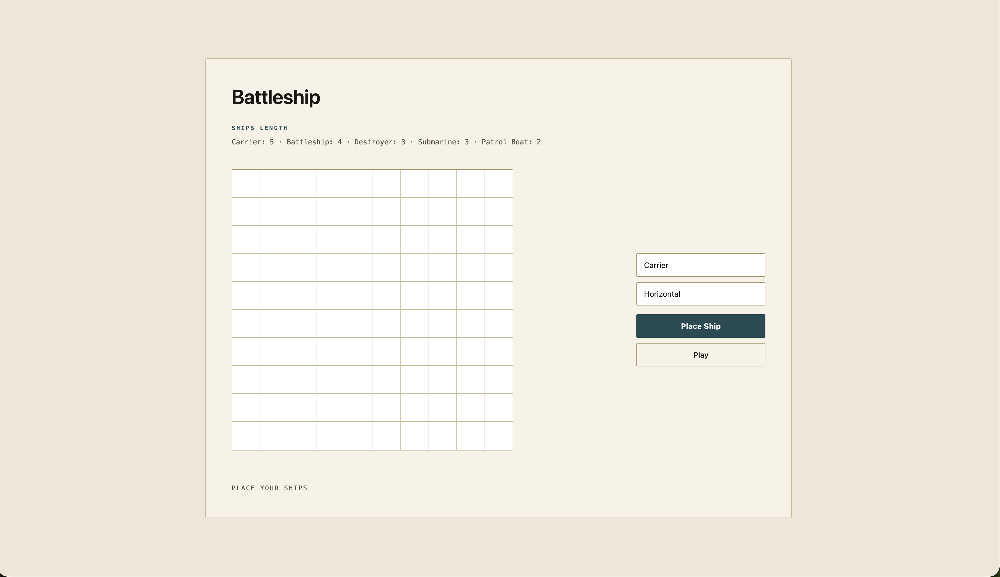

# Battleship

A browser-based Battleship game built with JavaScript.

## Preview



## Live Demo

[Play Battleship](https://akshat-tyagi1.github.io/battleship/)

## Features

* 10×10 game boards
* Manual ship placement
* Horizontal and vertical ship placement
* Random computer ship placement
* Player vs computer gameplay
* Hit and miss tracking
* Win and lose detection
* Replay functionality
* Unit tests with Jest

## Built With

* HTML
* CSS
* JavaScript
* Webpack
* Jest

## How to Run Locally

Clone the repository:

```bash
git clone https://github.com/akshat-tyagi1/battleship.git
cd battleship
```

Install dependencies:

```bash
npm install
```

Start the development server:

```bash
npm start
```

## What I Learned

* Structuring a JavaScript application using modules
* Object-oriented programming with classes
* Managing game state
* DOM manipulation and event handling
* Writing unit tests with Jest
* Using Webpack to bundle a JavaScript application
* Using ESLint and Prettier to maintain code quality
